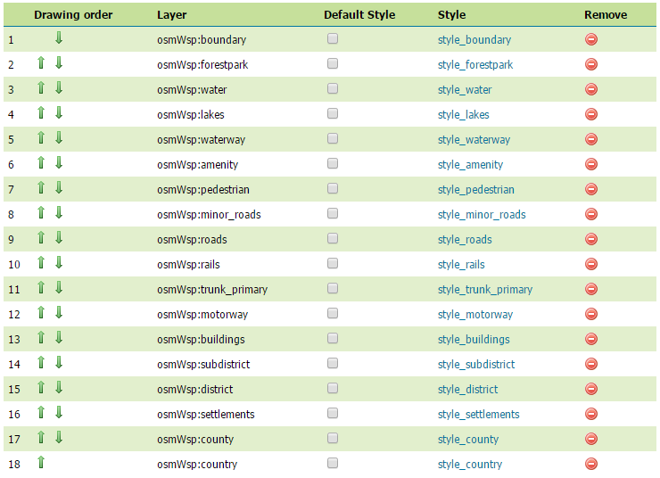
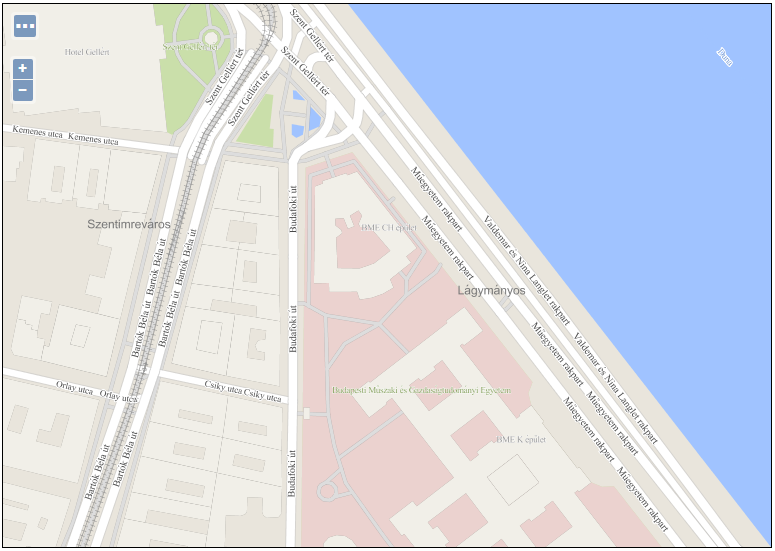
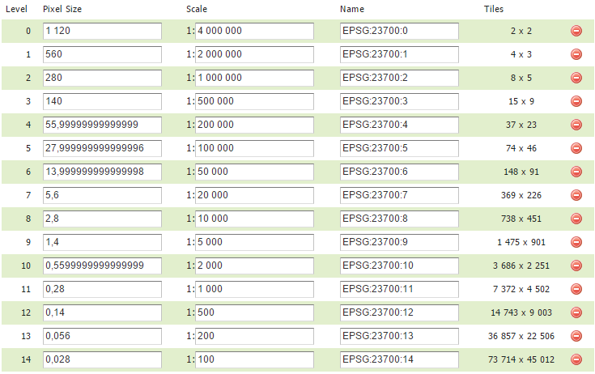
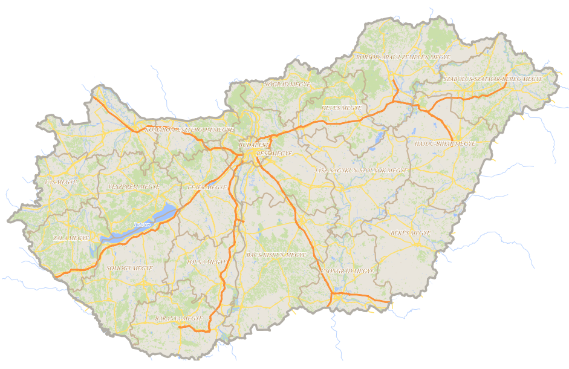

# osmgwc

> A step-by-step tutorial to create a geowebcache layer from OSM data which will look a lot like Google Maps

[](https://gitter.im/osmgwc/Lobby?utm_source=badge&utm_medium=badge&utm_campaign=pr-badge&utm_content=badge)

## What is osmgwc?

Osmgwc is a step-by-step tutorial of how to create a fast cached WMS layer which will hopefully look similar to Google Maps' design. The main difference is that it will be based on the free and open source OpenStreetMap (OSM) data, stored in a PostGIS database and served with GeoServer. Another difference is that it will be stored in the spatial reference system (SRS) of your choice.

If you follow the steps below, you will download OSM data, create an empty database, populate it with geodata in the desired SRS, then split the data into different tables (settlements, rivers etc.), add them as layers in GeoServer, style them with CSS styles, create a combined layer group, define a grid for your SRS, then finally publish a cached layer.

In this tutorial the data for Hungary will be used. The size of this country's OSM data requires reasonable time to process. 

## Live demo

You can check the outcome of this tutorial by clicking [here](http://188.166.116.137:8081/geoserver/gwc/demo/osm_hungary?gridSet=EPSG:23700&format=image/png).

## Prerequisites

* PostgreSQL with PostGIS: 

    For this tutorial I used [PostgreSQL v.9.6.1 with PostGIS v.2.3.0](http://www.enterprisedb.com/products-services-training/pgdownload)

* GeoServer with the CSS plugin: 

    For this tutorial I used [GeoServer v.2.10.0](http://geoserver.org/release/2.10.0/). Download the CSS plugin from [here](https://sourceforge.net/projects/geoserver/files/GeoServer/2.10.0/extensions/geoserver-2.10.0-css-plugin.zip/download), then unzip it into GeoServer's lib folder which can be found here: [GeoServer install dir]/webapps/geoserver/WEB-INF/lib, then restart GeoServer.

* osm2pgsql

    osm2pgsql is an open source tool to populate a PostGIS database with osm data. For Windows download from [here](https://ci.appveyor.com/project/openstreetmap/osm2pgsql/build/artifacts), for Linux run this command: ```apt-get install -y osm2pgsql```

* bzip2

    bzip2 is an unzipper tool that can be used to extract data from .bz2 files. For Windows download from [here](http://www.bzip.org/downloads.html), for Linux run this command: ```apt-get install -y bzip2```

* proj

    To be able to store OSM data in an SRS of your choice the proj library is needed. If you use Windows, the usage of [OSGeo4W](http://trac.osgeo.org/osgeo4w/) is recommended. With advanced install you should select the proj package from the commandline utilities as well as from the libs. If you use Linux run this command: ```apt-get install -y libproj-dev```

## Download OSM data

The data is freely available on GEOFABRIK's [download site](http://download.geofabrik.de/). For Hungary download the latest dataset in bz2 format from [here](http://download.geofabrik.de/europe/hungary-latest.osm.bz2) (~200 MB). After download, extract it to a folder of your choice. Its extension is .osm and its size is about 2.5 GB.

## Create a new PostGIS database

Create a new database (in this tutorial this will be called 'osm'), then run this for the newly created database:

```sql
create extension postgis;
```

## Populate the database with OSM data

Navigate to the folder of the extracted .osm file, and run osm2pgsql (here with Windows syntax):

```bat
C:\Programok\osm2pgsql\osm2pgsql -s -H localhost -P 5432 -U postgres -W -d osm hungary-latest.osm --cache-strategy sparse --cache 100 -E 23700 -S C:\Programs\osm2pgsql\default.style
```

Parameters are:

* H: host (in this case: localhost)
* P: port (the default port is 5432 for PostgreSQL)
* U: PostgreSQL user (default user is postgres)
* d: database name (in this case: osm)
* E: coordinate reference system (in this case: 23700)
* S: sometimes osm2pgsql requires a default.style file, you can find it in osm2pgsql's install dir
* cache-strategy and cache: if your machine is not very strong use these parameters, otherwise you can omit them

This will take a while based on the size of your data and your machine's capabilities. For me it took around 10 minutes to process.

If the command ran successfully, you will see the following new tables in the 'public' schema: planet_osm_line, planet_osm_nodes, planet_osm_point, planet_osm_polygon, planet_osm_rels, planet_osm_roads, planet_osm_ways. Make sure you have all of them!

## Create some PostGIS tables

Now you have a lot of uncategorized data in your database now. It would be great to have a separate table for every category you wish to visualize on your map e.g. settlements, rivers, roads etc. Fortunately you only have to execute one single SQL script from the "sql" folder of this project (```create_separate_tables.sql```). After running it (via [pgAdmin](https://www.pgadmin.org/download/) for instance), you will have a new schema called "osm" populated with 18 new tables, including the necessary (spatial) indexes.

If you wish to use a different SRS (other than EPSG:23700) make sure you manually change all occurences of "23700" to the desired EPSG code in the provided SQL file before execute it!

After execution, if you would like to free up some space from the database you can delete the unnecessary tables from the public schema by executing the ```drop_unnecessary_tables.sql``` file.

## Create some GeoServer CSS styles

In this step you will create styles by importing CSS files from this project's css folder. With these CSS files your map will look a lot like Google Maps.

First log into GeoServer's admin page, navigate to "Styles", then hit "Add a new style". There, from the "Format" dropdown select "CSS" and click on the "Choose File" button below. Navigate to this project's "css" folder, click on the first CSS file (```style_amenity.css```) and after opening it hit "Upload" on the admin page. In the style editor you will see this:

```css
[@scale < 100001] { 
  fill: #f9edd5; 
}
```

Add a name to the style like "style_amenity" and hit "Submit". Repeat it with all the remaining CSS files. At the end, you will have 18 GeoServer styles.

## Create some GeoServer layers

In this step you will connect GeoServer to the PostGIS database's "osm" schema with a Store. From this store you will add all the layers from the database schema with a default style from one of the styles you just added recently. 

From the admin page, hit "Stores" and then "Add new store". Select "PostGIS" and fill the form with the necessary parameters (Data Source Name, dbtype, host, port, database, schema, user, password), then hit save. Set the schema to "osm" since this is the schema that was created by the SQL script which stores the data of the categorized geometries.

If you succeeded (managed to connect to the database) you will see the list of available tables that you can add as layers. Select the first one ("amenity") by hitting "Publish". You are then navigated to the "Edit layer" page where you have to fill the "Bounding Boxes" part by hitting on "Compute from data" and "Compute from native bounds". You will see that the Coordinate Reference System is recognized as EPSG:23700.

On the second tab ("Publishing") set the default style according to the layer name (in this case: "style_amenity") and at the end of the page hit "Save". You just have successfully created a layer which looks like a Google Maps layer!

You have to add all the other layers as well like this: on the admin page, hit "Layers", then "Add new layer", choose the recently created store, and select the next layer by hitting "Publish". From this you can continue just like the previous example.

At the end you will have 18 new layers, all set with a previously created GeoServer style.

## Create a Layer Group

Most likely you wish to publish your cached WMS service as one single layer instead of a bunch of individual layers. With GeoServer you can create a layer group that combines individual layers with an appearance order. You can define which layers should be on top and which ones on bottom.

Click on "Layer Groups" on the admin page, then "Add new layer group". Name your layer group e.g. "osm_hungary". Next, add your layers individually by clicking on the "Add Layer..." button. The order of the layers is very important. This is how your layer order should look like:



After you added all the 18 layers, click on "Generate Bounds", then on "Save".

## Preview the layer group

Before creating a cached WMS service it would be nice to look what you've accomplished so far. Click on "Layer Preview" on the admin page, scroll down to the "osm_hungary" layer group and click on "OpenLayers". You will be navigated to a new page with a live WMS service of your layer group. You can zoom & pan the interactive map, and you should see that it is reasonably fast (at least compared to how many layers and styles the GeoServer has to synchronize not to mention the amount of data). You should see that it  indeed looks a lot like Google Maps itself:



## Why cached?

If you tried to preview the layer group as suggested above you requested the GeoServer to do a lot of calculation each time you zoomed or panned the map. For one user this was relatively fast, but imagine a lot of users requesting the same layer group at the same time. After a while, GeoServer will not be able to serve the clients with an acceptable speed. However, if the server stores a generated tile for a given zoom level in an image file (jpg, png etc.), it does not have to render it again, but instead simply send that image back to the client. It saves a LOT of computation. Every major WMS tile servers (OpenStreetMap, Google, Bing etc.) use some caching method.

## Create a Gridset for your SRS

A Gridset is a collection of different zoom levels for a given spatial reference system with a tile size (256x256 pixels usually). However, if you create a cached WMS service with an SRS other than EPSG:4326 or EPSG:900913, you have to define your own gridset. Since the OSM data is now in EPSG:23700 you will define a gridset for EPSG:23700.

To do that, click on "Gridsets" on the admin page, then on "Create a new gridset". Give it a name (e.g. EPSG:23700), at the "Coordinate Reference System" section click on "Find...", find the one with the code "23700" (description: HD72/EOV), click on the code. Then click on "Compute from maximum extent of CRS". Next you will add the above mentioned zoom levels. Click on "Scale denominators" at the "Tile Matrix Set" section, and click on "Add zoom level" 15 times. Enter a scale and a name for each level. At the end, your gridset should look like this:



After that, click on "Save". Your newly created gridset should be visible among the other gridsets.

## Create a cached WMS service

Navigate to your layer group by click on "Layer Groups" and select "osm_hungary". Click the tab called "Tile Caching", and check the checkbox for "Create a cached layer for this layer group". After that, a lot of options are visible, but only these are important:

* check the checkbox for "Enable tile caching for this layer"
* "Metatiling factors" should be 4 tiles wide, 4 tiles high
* "Tile Image Formats": only select "image/png"
* at the "Gridset" section remove "EPSG:900913" and "EPSG:4326" by clicking on the red circle at the end of their line
* add your gridset with the "Add grid subset" dropdown (after selecting "EPSG:23700", don't forget to click on the green plus icon next to it)

If all parameters are set correctly, hit "Save".

To see how your cached service looks like, go to "Tile Layers". You must see your layer group in the list. There is a dropdown for the "Preview" column, select "EPSG:23700 / png". You will jump to a new preview site of the layer group. You can zoom & pan just like before. But there is one big difference: if you zoom & pan, you will experience that it is a bit slower than before. It is because this is the exact moment when GeoServer stores the rendered images in its folder hierarchy and it takes some extra time. But if you refresh the page, however, the map should be visible instantly. If you zoom & pan to an area you have been before, the map will refresh also in no time. This is because of the tile caching.



Or you can always check the live demo [here](http://188.166.116.137:8081/geoserver/gwc/demo/osm_hungary?gridSet=EPSG:23700&format=image/png).

## Final words

If you successfully completed this tutorial you hopefully learned a lot about GeoServer and its CSS styling. Using CSS is much more easier and fun than the old SLD styling. If you don't like my design you can easily add your own styles and create a better map, it is completely up to you. I just hope that I made the whole process a bit easier so that you can focus on the styling from a solid base. 

## Author
Osmgwc was created by [Gergely Padányi-Gulyás](http://gpadanyig.com)